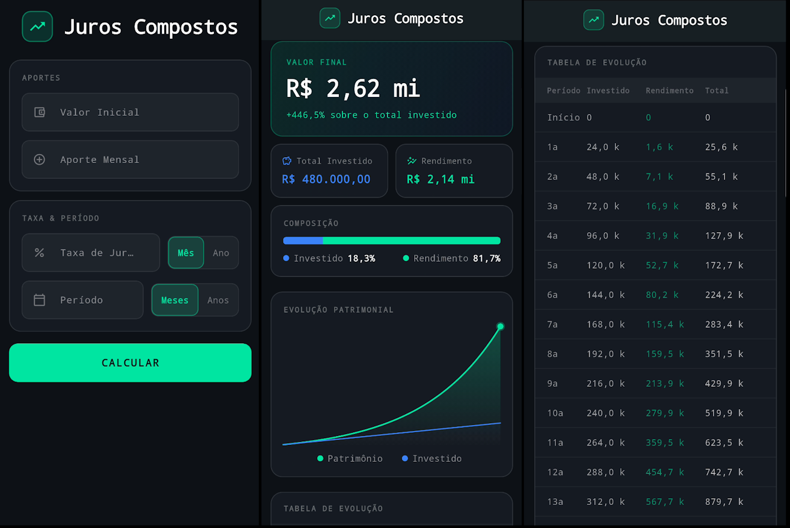

# Juros Compostos

Aplicativo Flutter para cálculo de juros compostos com aporte inicial, aporte mensal, taxa de juros e período de investimento.

## Screenshot



## Visão geral

O app permite:
- Inserir valor inicial e aporte mensal
- Definir taxa de juros como mensal ou anual
- Calcular o período em meses ou anos
- Visualizar o total acumulado, total investido e juros ganhos
- Exibir gráfico de evolução e tabela de histórico mensal

## Recursos

- Tema escuro moderno com Material 3
- Validação básica de formulário
- Conversão de taxa anual para mensal automaticamente
- Formatação de moeda brasileira (R$)
- Gráfico de evolução do saldo ao longo do tempo
- Tabela de histórico de aportes e saldo acumulado

## Instalação

1. Certifique-se que o Flutter está instalado e configurado:
   ```bash
   flutter --version
   ```
2. No diretório do projeto, instale as dependências:
   ```bash
   flutter pub get
   ```
3. Execute o app em um dispositivo ou emulador:
   ```bash
   flutter run
   ```

## Estrutura do projeto

- `lib/main.dart` - lógica principal do app, UI e função de cálculo
- `pubspec.yaml` - dependências do Flutter e configuração do projeto

## Notas

- O projeto usa o SDK Dart `^3.9.0` conforme definido em `pubspec.yaml`.
- A aplicação é preparada para uso local e não está configurada para publicação no pub.dev.

## Como usar

1. Informe o `Valor Inicial` e o `Aporte Mensal`.
2. Digite a `Taxa de Juros` e selecione se ela é `Mês` ou `Ano`.
3. Digite o `Período` e selecione se é em `Meses` ou `Anos`.
4. Toque em `CALCULAR` para ver os resultados e o gráfico.

## Licença

Projeto de demonstração sem licença específica. Use livremente para estudo e aprendizado.
